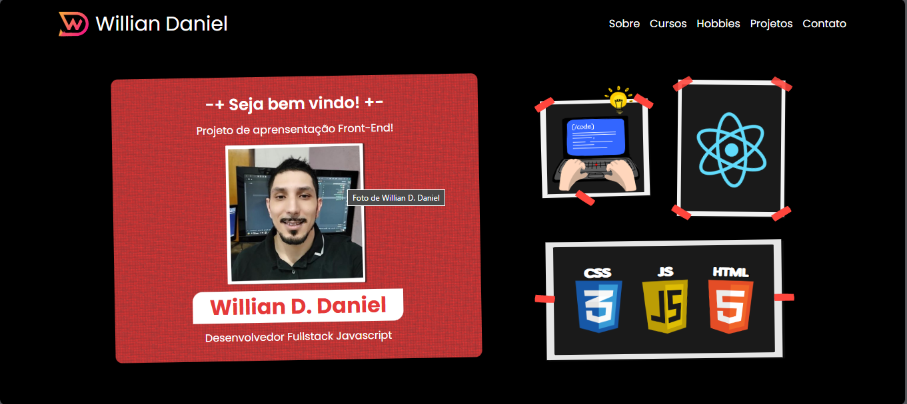

## First feat.

- Created HeaderContainer component and added the content inside it (briefly project's presentation, my photo and also an image right there with animation).

- Changed html=lang tag for pt-br

- Added the base param to defineConfig on vite.config for the first deploy requirements

- It was maked first build

## Components and templates modified in this commit

- HeaderContainer Component and Header Template(added HeaderComponent within)

- index.html 

- vite.config.js

## Mobile Screeshot

Not finished yet

## Browser Screeshot
