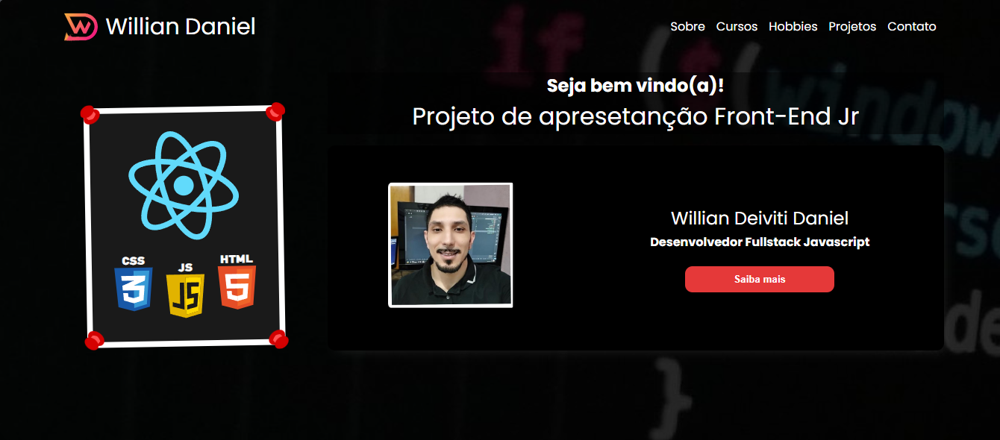
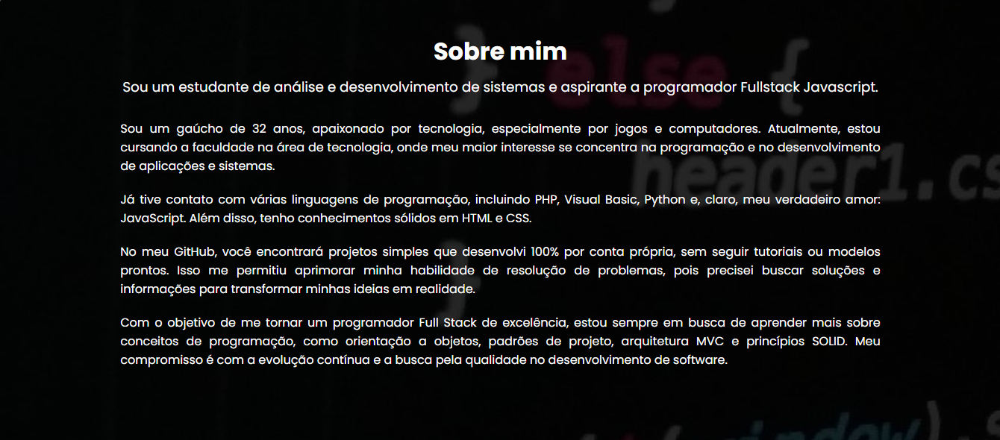
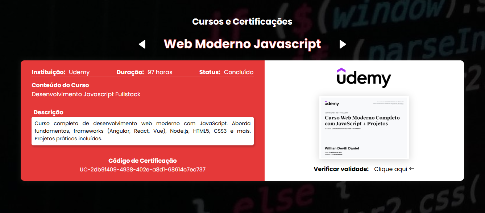

## New feats.

- Updated the Header design
- Added two new sections: "About" to introduce myself and "Courses" to showcase my completed courses
- Created a Button component 
- Added an assets file in JavaScript to populate the Courses section with images and links for certificate verification

## Components and templates modified and/or created in this commit

### Modified
- Components: HeaderContainer

### Created
- Templates: Section About, Section Courses.
- Components: CoursesContainer, Button

## Mobile Screeshot

Not finished yet

## Browser Screeshot (Header)

## Browser Screeshot (About)

## Browser Screeshot (Courses)
